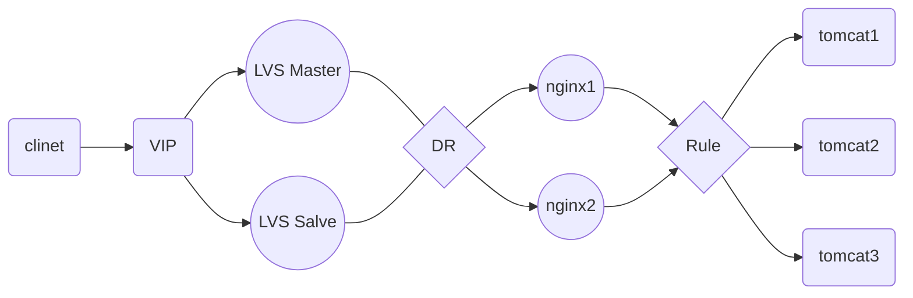

#### NGINX+KEEPALIVED+LVS+TOMCAT高可用部署

##### 信息划分

| 描述           | 网卡 | IP              | 端口 |
| -------------- | ---- | --------------- | ---- |
| LVS MASTER     | eth0 | 192.168.1.141 | 80   |
| LVS SLAVE      | eth0 | 192.168.1.142 | 80   |
| Nginx 1        | eth0 | 192.168.1.139 | 80   |
| Nginx 2        | eth0 | 192.168.1.140 | 80   |
| Tomcat 1       | eth0 | 192.168.1.138 | 8080 |
| Tomcat 2       | eth0 | 192.168.1.138 | 8081 |
| Tomcat 3       | eth0 | 192.168.1.138 | 8082 |
| Keepalived VIP |      | 192.168.1.200 |      |

##### 架构图



##### 安装步骤

###### 1. 安装KA，IPVSADM

```
yum install -y keepalived ipvsadm
```

###### 2. 配置KA（LVS MASTER）

```shell
global_defs
{
router_id master_210
}
 
vrrp_instance aiyou {
state MASTER
interface eth0      # 数据流量走的网卡
virtual_router_id 100  #这个数值 master和slave必须统一
priority 151    #权重
advert_int 1
authentication {
        auth_type PASS
        auth_pass 123456
        }
virtual_ipaddress {
        192.168.1.200
        }
}
virtual_server 192.168.1.200 80 {
            delay_loop 6
            lb_algo wrr
            lb_kind DR
#           persistence_timeout 50
            protocol TCP
real_server 192.168.1.139 80 {
                weight 1
                TCP_CHECK {
                    connect_timeout 3
                    nb_get_retry 3
                    delay_before_retry 3
                    connect_port 80
                }
            }
real_server 192.168.1.140 80 {
                weight 1
                TCP_CHECK {
                    connect_timeout 3
                    nb_get_retry 3
                    delay_before_retry 3
                    connect_port 80
                }
            }
}
```

###### 3. 配置KA（LVS SLAVE）

```shell
global_defs
{
router_id slave_211
}
 
vrrp_instance aiyou {
state MASTER
interface eth0          # 数据流量走的网卡
virtual_router_id 100    #这个数值 master和slave必须统一
priority 150     #权重
advert_int 1
authentication {
        auth_type PASS
        auth_pass 123456
        }
virtual_ipaddress {
        192.168.1.200
        }
}
virtual_server 192.168.1.200 80 {
            delay_loop 6
            lb_algo wrr
            lb_kind DR
#            persistence_timeout 50
            protocol TCP
real_server 192.168.1.139 80 {
                weight 1
                TCP_CHECK {
                    connect_timeout 3
                    nb_get_retry 3
                    delay_before_retry 3
                    connect_port 80
                }
            }
real_server 192.168.1.140 80 {
                weight 1
                TCP_CHECK {
                    connect_timeout 3
                    nb_get_retry 3
                    delay_before_retry 3
                    connect_port 80
                }
            }
}
```

###### 4. 配置RS(Nginx1)

**运行脚本**

```shell
#!/bin/bash  
#   
# Script to start LVS DR real server.   
# description: LVS DR real server   
#   
.  /etc/rc.d/init.d/functions
VIP=192.168.1.200   #这里根据需要改成自己的VIP地址
host=`/bin/hostname`
case "$1" in  
start)   
       # Start LVS-DR real server on this machine.   
        /sbin/ifconfig lo down   
        /sbin/ifconfig lo up   
        echo 1 > /proc/sys/net/ipv4/conf/lo/arp_ignore   
        echo 2 > /proc/sys/net/ipv4/conf/lo/arp_announce   
        echo 1 > /proc/sys/net/ipv4/conf/all/arp_ignore   
        echo 2 > /proc/sys/net/ipv4/conf/all/arp_announce
        /sbin/ifconfig lo:0 $VIP broadcast $VIP netmask 255.255.255.255 up  
        /sbin/route add -host $VIP dev lo:0
;;  
stop)
        # Stop LVS-DR real server loopback device(s).  
        /sbin/ifconfig lo:0 down   
        echo 0 > /proc/sys/net/ipv4/conf/lo/arp_ignore   
        echo 0 > /proc/sys/net/ipv4/conf/lo/arp_announce   
        echo 0 > /proc/sys/net/ipv4/conf/all/arp_ignore   
        echo 0 > /proc/sys/net/ipv4/conf/all/arp_announce
;;  
status)
        # Status of LVS-DR real server.  
        islothere=`/sbin/ifconfig lo:0 | grep $VIP`   
        isrothere=`netstat -rn | grep "lo:0" | grep $VIP`   
        if [ ! "$islothere" -o ! "isrothere" ];then   
            # Either the route or the lo:0 device   
            # not found.   
            echo "LVS-DR real server Stopped."   
        else   
            echo "LVS-DR real server Running."   
        fi   
;;   
*)   
            # Invalid entry.   
            echo "$0: Usage: $0 {start|status|stop}"   
            exit 1   
;;   
esac
```

###### 5. 配置RS(Nginx2)

**运行脚本**

```shell
#!/bin/bash  
#   
# Script to start LVS DR real server.   
# description: LVS DR real server   
#   
.  /etc/rc.d/init.d/functions
VIP=192.168.1.200   #这里根据需要改成自己的VIP地址
host=`/bin/hostname`
case "$1" in  
start)   
       # Start LVS-DR real server on this machine.   
        /sbin/ifconfig lo down   
        /sbin/ifconfig lo up   
        echo 1 > /proc/sys/net/ipv4/conf/lo/arp_ignore   
        echo 2 > /proc/sys/net/ipv4/conf/lo/arp_announce   
        echo 1 > /proc/sys/net/ipv4/conf/all/arp_ignore   
        echo 2 > /proc/sys/net/ipv4/conf/all/arp_announce
        /sbin/ifconfig lo:0 $VIP broadcast $VIP netmask 255.255.255.255 up  
        /sbin/route add -host $VIP dev lo:0
;;  
stop)
        # Stop LVS-DR real server loopback device(s).  
        /sbin/ifconfig lo:0 down   
        echo 0 > /proc/sys/net/ipv4/conf/lo/arp_ignore   
        echo 0 > /proc/sys/net/ipv4/conf/lo/arp_announce   
        echo 0 > /proc/sys/net/ipv4/conf/all/arp_ignore   
        echo 0 > /proc/sys/net/ipv4/conf/all/arp_announce
;;  
status)
        # Status of LVS-DR real server.  
        islothere=`/sbin/ifconfig lo:0 | grep $VIP`   
        isrothere=`netstat -rn | grep "lo:0" | grep $VIP`   
        if [ ! "$islothere" -o ! "isrothere" ];then   
            # Either the route or the lo:0 device   
            # not found.   
            echo "LVS-DR real server Stopped."   
        else   
            echo "LVS-DR real server Running."   
        fi   
;;   
*)   
            # Invalid entry.   
            echo "$0: Usage: $0 {start|status|stop}"   
            exit 1   
;;   
esac
```

###### 6. 验证

**LVS MASTER**

```
[root@lvs1 ~]# ipvsadm -ln
IP Virtual Server version 1.2.1 (size=4096)
Prot LocalAddress:Port Scheduler Flags
  -> RemoteAddress:Port           Forward Weight ActiveConn InActConn
TCP  192.168.1.200:80 wrr
  -> 192.168.1.139:80           Route   1      0          0         
  -> 192.168.1.140:80           Route   1      0          0         
```

**LVS SLAVE**

```
[root@lvs1 ~]# ipvsadm -ln
IP Virtual Server version 1.2.1 (size=4096)
Prot LocalAddress:Port Scheduler Flags
  -> RemoteAddress:Port           Forward Weight ActiveConn InActConn
TCP  192.168.1.200:80 wrr
  -> 192.168.1.139:80           Route   1      0          0         
  -> 192.168.1.140:80           Route   1      0          0         
```

###### 7. Tomcat(暂时不做介绍)


